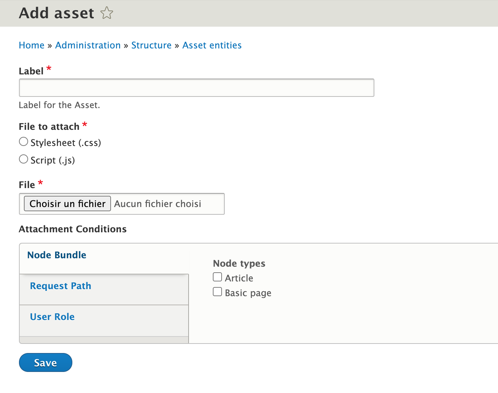

INTRODUCTION
------------

This module gives the possibility to attach js and css files to the site's nodes.
Each asset is a configuration entity.
The attachment conditions can be configured in the entity creation/edit page.

REQUIREMENTS
------------

This module requires no modules outside of Drupal core.

INSTALLATION
------------

* Install the module as you would normally install a contributed Drupal module. Visit
  https://www.drupal.org/node/1897420 for further information.

CONFIGURATION
-------------

* The module has no modifiable settings. There is no configuration. When
  enabled, the module will provide a new configuration entity listing that can be accessed from `Structure > Asset` or via the url `/admin/structure/asset`.

SCREENSHOTS
-------------

